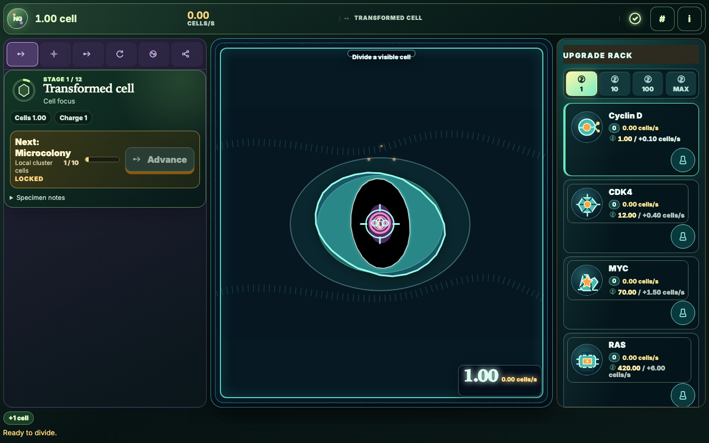
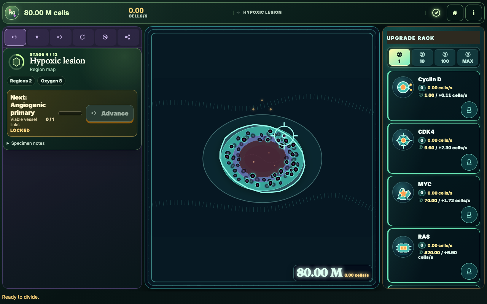
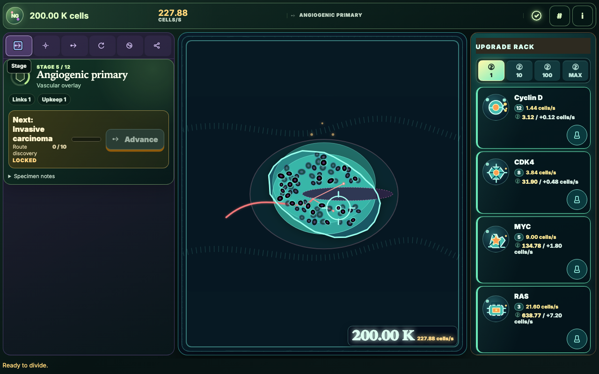
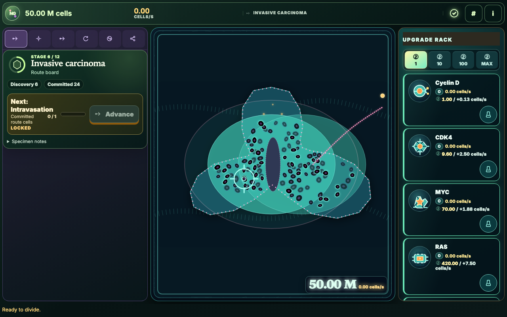
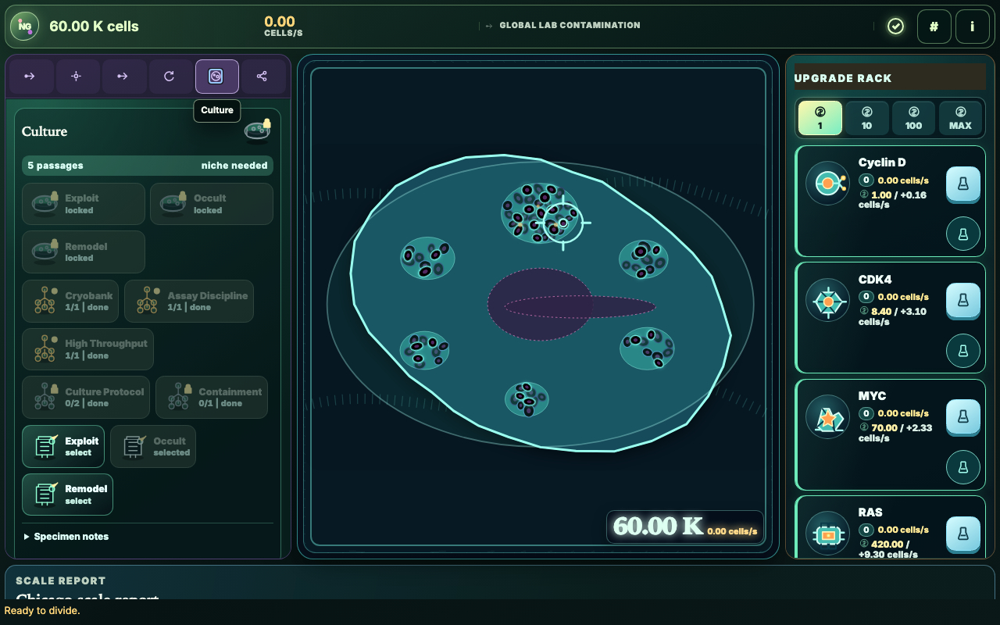
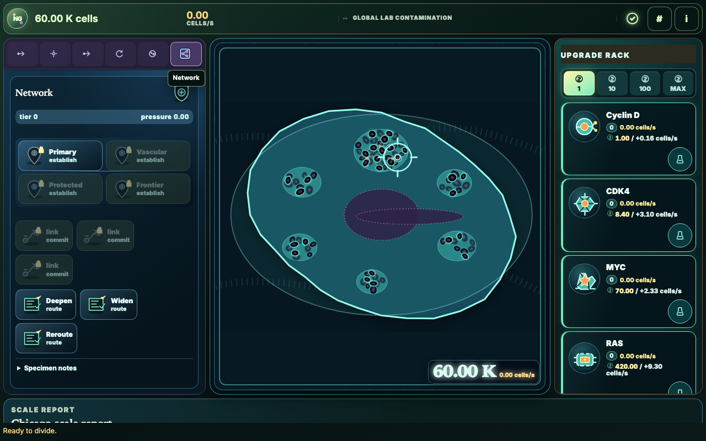
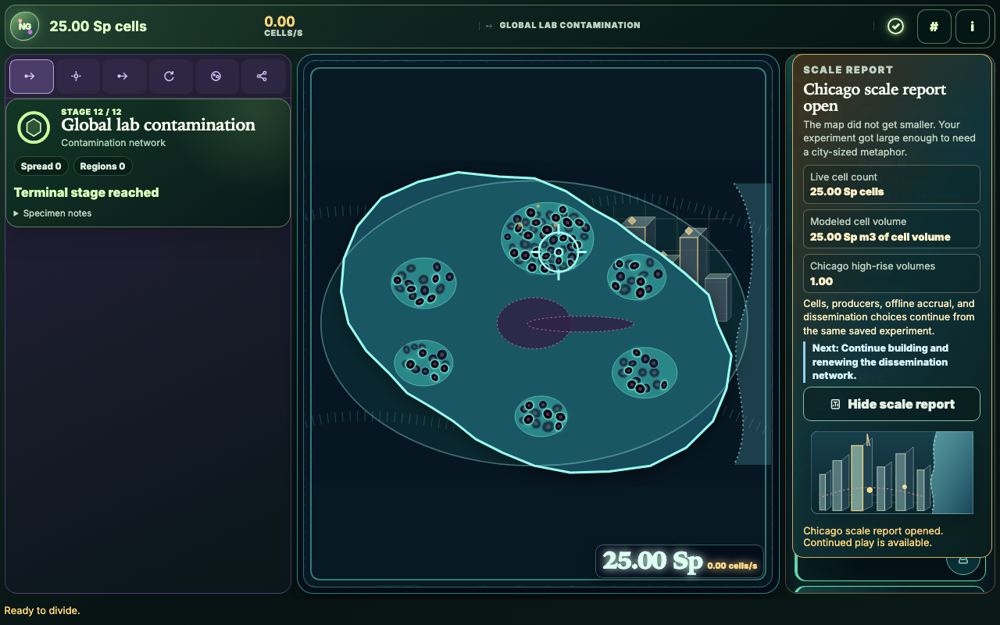

# Cancer Clicker NG

A SolidJS browser game for biology learners who want to explore cancer as a living system of growth, scarcity, adaptation, and tradeoffs through direct cell clicking.

## Next Gen, under pressure

NG means **Next Gen**: a superified, more ambitious cancer clicker where the biology changes each
decision instead of merely decorating larger numbers. It is for learners, educators, and curious
builders who want systems thinking to be the game. The work is a stylized teaching abstraction,
not clinical advice or a depiction of patients.

Its signature promise is a recognizable incremental-game rhythm with a genuinely changing world:
click cells that you can see, spend the cells you earn on a permanent upgrade surface, and watch a
single transformed cell become a vascularized, hypoxic, invasive tumor with decisions that remain
meaningful as the system grows.

## A living clicker board

The primary 1280 x 800 (16:10) view is a visual game canvas:

- **Living tumor arena:** the tumor is the largest object and the direct action. Click rendered
  cells, see the division pulse at the cell you touched, and watch vessels, hypoxia, necrosis,
  invasion, and new sites change the same tissue world.
- **Scoreboard HUD:** cell count, production rate, stage, save state, and compact utilities stay in
  one shallow instrument strip.
- **Evolution dock:** six small icon tabs expose one active decision family at a time. The stage
  gate, 14 hallmark sigils, routes, resets, culture, and network remain discoverable without
  stacking explanatory panels.
- **Upgrade rack:** eight illustrated molecular machines are always available at the right. Each
  whole row shows its owned level, cost, and marginal production; quantity, assay, and detail
  controls use small icons.

Biology prose lives in focusable tooltips, optional specimen notes, and a focus-restoring specimen
drawer. The permanent canvas stays focused on art, numbers, state, and the next action.

The board takes inspiration from the satisfying always-upgradable structure of Cookie Clicker, but
uses an original, editable SVG tumor vocabulary and a scientific, nonclinical art direction.

<!-- screenshots:begin (managed by screenshot-docs) -->



<details>
<summary>Central tumor progression: hypoxic core, perfusion, and invasive route</summary>




</details>




<!-- screenshots:end -->

## What you can explore

- Drive the core loop with direct visible-cell clicks, eight data-defined producers, and purchases
  in `1`, `10`, `100`, or maximum-affordable quantities.
- Make decisions across all 14 cancer hallmark branches, including allocation, checkpoints,
  damage, replicative reserve, perfusion, routes, ATP, immune visibility, inflammation, mutation,
  phenotype, programs, microbiomes, and senescence.
- Progress through Metastasis, Host Transfer, Immortalization, and Dissemination. Culture choices
  retain auditable producer provenance; dissemination renews saved topology campaigns with
  node-local containment and transparent pressure credit.
- Save anonymous local progress, reload it through the exact current state-schema contract, and
  receive an honest offline-gain report without automatic spending or progression choices.
- Use development semantic replay to re-run accepted event histories against normalized durable
  state and visible progression. This diagnostic tool is separate from offline economic replay and
  from the player save format.
- Reach an optional, explicitly earned Chicago-scale presentation after the required stage,
  dissemination tier, and modeled cell-scale conditions. It preserves the live colony and lets play
  continue; it is a transparent fictional volume analogy, not a real-world measurement claim.

## Play the first loop

Prerequisite: a current Node.js installation with npm. From the repository root:

```bash
npm install
npm run serve
```

Open the local URL printed by the server. Click a visible cancer cell in the tumor arena, then buy
an illustrated machine from the upgrade rack. The scoreboard rate increases and the evolution dock
shows the next biological opportunity. Reload after a little play to confirm local persistence.
When time away produces a bounded gain, the **Offline progress** report explains it. Stop the
foreground server with `Ctrl-C`.

Build the GitHub Pages-shaped artifact without serving it:

```bash
npm run build
```

## Verify the local game

Run the canonical TypeScript, formatting, lint, and domain-test gate:

```bash
./check_codebase.sh
```

For production-browser behavior, rebuild and exercise the served `dist/` surface:

```bash
npm run test:playwright -- --build
```

The browser and visual lanes prove controls, storage, responsive layout, accessibility, and rendered
biology. They complement the fast deterministic Node/tsx suite; neither test count nor a pixel or
timing threshold is a release criterion.

## Status and boundaries

Cancer Clicker NG is pre-production software under active local validation. The project can improve
its foundations without legacy-compatibility promises: saves use exactly the current format-2,
state-schema-8 contract. Other shapes enter the protected recovery flow instead of being adapted
into invented history.

The local game, source build, and semantic tests are distinct from human and remote release work.
GitHub Pages publication, an independent visual acceptance review, release packaging, and human Git
approval remain explicit follow-on evidence rather than claims made by this README. The forthcoming
balance laboratory will compare player policies and report calibration observations; it does not
declare a fixed numerical, byte, pixel, or machine-timing gate.

## Documentation

Start with the player-facing and operating routes:

- [docs/USAGE.md](docs/USAGE.md) - player flows, controls, and local browser use.
- [docs/INSTALL.md](docs/INSTALL.md) - prerequisites and setup details.
- [docs/GAME_DESIGN.md](docs/GAME_DESIGN.md) - the player loop, Chicago-scale culmination, and
  offline-replay promise.
- [docs/PROGRESSION_DESIGN.md](docs/PROGRESSION_DESIGN.md) - the 14 hallmark branches and
  stage-based decisions.
- [docs/PRESTIGE_DESIGN.md](docs/PRESTIGE_DESIGN.md) - the four reset layers, culture workflow,
  and renewable dissemination topology.
- [docs/ART_DIRECTION.md](docs/ART_DIRECTION.md) - the living-tumor SVG contract, direct-cell
  action, compact icons, and 1280 x 800 composition.

For architecture, persistence, and development work:

- [docs/CODE_ARCHITECTURE.md](docs/CODE_ARCHITECTURE.md) - system boundaries and source owners.
- [docs/FILE_STRUCTURE.md](docs/FILE_STRUCTURE.md) - where game, rendering, test, and build files
  live.
- [docs/SOLID_MODEL.md](docs/SOLID_MODEL.md) - the SolidJS client boundary and UI reactivity model.
- [docs/STATE_PERSISTENCE.md](docs/STATE_PERSISTENCE.md) - the exact current save, event funnel,
  protected recovery, and semantic replay.
- [docs/PLAYWRIGHT_USAGE.md](docs/PLAYWRIGHT_USAGE.md) - production-browser verification and the
  screenshot workflow.
- [docs/active_plans/implementation_plan.md](docs/active_plans/implementation_plan.md) - the
  durable implementation roadmap and acceptance ownership.

## License

Source code is available under the [MIT License](LICENSE.MIT).
